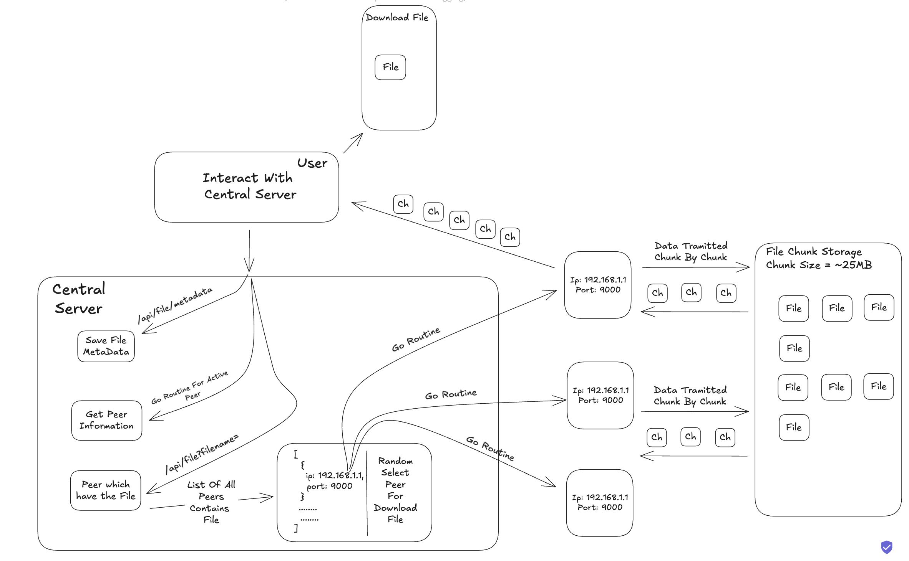

# 📘 PeerNote — Peer-to-Peer Note Sharing Platform (P2P over TCP)

PeerNote is a fully-local, peer-to-peer (P2P) file sharing system that enables students to share and fetch academic notes directly from each other over TCP. No cloud. No central storage. Just clean, fast, decentralized distribution.

---

## 🚀 Features

- ✅ **Peer-to-Peer File Sharing (TCP Based)**
- ✅ **Central Metadata Registry (PostgreSQL)**
- ✅ **Search by Course, Professor, or Keywords**
- ✅ **Live Peer Discovery via Central Server**
- ✅ **Structured File Storage per Course & Professor**
- ✅ **Retry Mechanism for Failed Connections**
- ✅ **Heartbeat Pings for Peer Liveness Detection**
- ✅ **File Chunking Support (Efficient Streaming)**
- ✅ **Clean Golang Monorepo Architecture**
- ✅ **Runs 100% Locally — No Cloud Required**

---

## 🧱 Folder Structure

```
peernote/
│
├── cmd/
│   ├── server/           # Central Server entrypoint
│   └── peer/             # Peer Node entrypoint (starts TCP server)
│
├── internal/
│   ├── db/               # DB connection + migrations
│   ├── handlers/         # HTTP handlers (central server)
│   ├── routes/           # Chi router setup
│   ├── models/           # Shared structs (Peer, File, etc.)
│   ├── peer/             # Peer-side business logic
│   │   ├── tcp/          # TCP Server: Listen, Accept, HandleConn
│   │   ├── discover/     # Fetch metadata from server
│   │   └── share/        # File streaming logic (send/receive)
│   └── utils/            # Logging, config, etc.
│
├── migrations/           # SQL migration files
├── storage/              # 🗂 Actual notes/files are stored here
│   └── peer_files/
│       └── CS101/
│           └── Dr._Alan_Turing/
│               └── Lecture1_Introduction.pdf
├── go.mod
└── README.md
```

---

## ⚙️ Technologies Used

- **Golang** — Primary language for both server and peer logic
- **PostgreSQL** — Central metadata store for files and peers
- **chi** — Lightweight router for HTTP server
- **TCP Sockets** — For direct file streaming between peers
- **bufio & net** — Native Go I/O and networking packages

---

## 🔄 Request Flow

1. 🔍 **Client Requests a Note:** Sends query to central server with file name/keyword.
2. 📦 **Central Server Responds:** Returns list of peers having that file.
3. 🔗 **Client Connects via TCP:** Selects a peer and opens TCP connection.
4. 📁 **File Transfer Begins:** File is streamed from `peer_files/` using metadata path.
5. 💾 **File is Saved:** On the client side under the same structured storage directory.



---

## 🛠 Running the Project

### 1. Clone the Repository

```bash
git clone https://github.com/your-username/peernote.git
cd peernote
```

### 2. Setup PostgreSQL Locally

Create DB:
```sql
CREATE DATABASE peernote;
```

Apply migrations:
```bash
go run cmd/server/main.go migrate
```

### 3. Run Central Server

```bash
go run cmd/server/main.go
```

### 4. Start a Peer Node

```bash
go run cmd/peer/main.go
```

Now, peers will register, upload notes, and be discoverable by others.

---

## 📁 File Storage Structure

When a file is uploaded, it is stored like:

```
./storage/peer_files/{CourseCode}/{ProfessorName}/{NoteName.pdf}
```

Example:
```
./storage/peer_files/CS101/Dr._Alan_Turing/Lecture1_Introduction.pdf
```

---

## ✅ Future Improvements

- [ ] File checksums for validation
- [ ] Chunked upload/download support
- [ ] CLI + UI for peer interaction
- [ ] Encrypted peer-to-peer transfer
- [ ] Peer reputation system

---

## 🤝 Contributing

Contributions are welcome! Fork the project and submit a PR.
